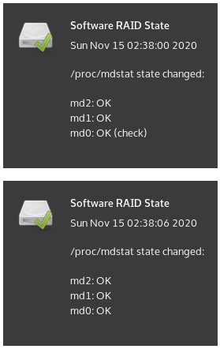

systray-mdstat
==============

[](https://travis-ci.org/xtaran/systray-mdstat)

`systray-mdstat` is a system tray icon indicating the state of local
[Linux Software (MD) RAID](https://raid.wiki.kernel.org/) by checking
`/proc/mdstat` periodically:



It works at least on Linux and should work with any
[freedesktop.org-compliant status area (aka system tray)](https://specifications.freedesktop.org/systemtray-spec/latest/).


Use Case
--------

The use cases for this utility are probably rather restricted:

* Desktop or laptop with
  [Linux Software RAID](https://raid.wiki.kernel.org/) (i.e. at least
  two permanent disks)

* Not wanting to have any remote monitoring (e.g. for privacy reasons
  or due to lacking a permanent internet connection or an appropriate
  monitoring server).


Requirements
------------

* [Perl 5](https://www.perl.org/) ≥ 5.10
* a bunch of Perl modules:
  * [Gtk3](https://metacpan.org/pod/Gtk3)
  * [Desktop::Notify](https://metacpan.org/pod/Desktop::Notify)
  * [List::Util](https://metacpan.org/pod/List::Util) (part of Perl's core)
  * [Pod::Usage](https://metacpan.org/pod/Pod::Usage) (part of Perl's core)
  * [Try::Tiny](https://metacpan.org/pod/Try::Tiny)
  * [File::ShareDir](https://metacpan.org/pod/File::ShareDir) to run
    and
    [File::ShareDir::Install](https://metacpan.org/pod/File::ShareDir::Install)
    to build and install.


Installation
------------

### From a Distribution Package

systray-mdstat is available in most Debian-based distribution releases since
about mid-2017:

* [Debian 10 Buster and later](https://packages.debian.org/systray-mdstat)
* Devuan 3.0 Beowulf and later
* Raspbian 10 Buster and later
* Trisquel 9.0 LTS Etiona and later
* [Ubuntu 18.04 LTS Bionic and later](https://packages.ubuntu.com/systray-mdstat)

Of course it's also available in rolling release distributions based
on Debian Testing or Unstable:

* Kali Linux
* ParrotOS
* PureOS

It's also available in these non-Debian based distributions:

* [Arch User Repository (AUR)](https://aur.archlinux.org/packages/systray-mdstat/)

For a complete and more current list of versions see the [nice
overview at
Repology](https://repology.org/project/systray-mdstat/versions):

[](https://repology.org/metapackage/systray-mdstat)


### Building from a Release Tar Ball

Works like most Perl modules or perl-based applications:

```
$ tar xzf systray-mdstat systray-mdstat-<version>.tar.gz
$ cd systray-mdstat-<version>
$ perl Makefile.PL
$ make
$ make test
$ make install
```

### Building from a Git Checkout

* Requires [Dist::Zilla](http://dzil.org/). Once Dist::Zilla is
  installed, running `dzil authordeps` will list the additionally
  needed Dist::Zilla plugins. After installing them, use `dzil build`
  to get a tar ball usable with any CPAN-compatible toolset.

  Afterwards continue as above.

* Building the Debian package from Git source requires the above plus
  [dh-dist-zilla](https://github.com/elmar/dh-dist-zilla) (which is
  also available as binary package in more recent releases of Debian
  and Ubuntu). Running `dpkg-checkbuilddeps` in the cloned git
  repository will list all missing build dependencies.


Companion Tools
---------------

* smart-notifier (website gone,
  [available in Debian](https://packages.debian.org/stable/smart-notifier),
  historic sources also available
  [via snapshot.debian.org](http://snapshot.debian.org/package/smart-notifier/):
  Notifies about S.M.A.R.T. changes your hard disks.


Similar Tools
-------------

* [diskmonitor for KDE](https://github.com/papylhomme/diskmonitor):
  Monitors both, SMART and MD RAID health status.


Version Number Scheme
---------------------

systray-mdstat adheres to [Semantic Versioning](http://semver.org/),
hence all version numbers have the scheme _Break.Feature.Bugfix_.


Author, Copyright and License
-----------------------------

Copyright © 2017-2020 by [Axel Beckert](https://axel.beckert.ch/)
<abe@deuxchevaux.org>

This program is free software; you can redistribute it and/or modify
it under the terms of the
[GNU General Public License](https://www.gnu.org/licenses/gpl) as
published by the [Free Software Foundation](https://fsf.org/); either
[version 3 of the License](https://www.gnu.org/licenses/gpl-3.0), or
(at your option) any later version.

This program is distributed in the hope that it will be useful, but
WITHOUT ANY WARRANTY; without even the implied warranty of
MERCHANTABILITY or FITNESS FOR A PARTICULAR PURPOSE.  See the GNU
General Public License for more details.

You should have received
[a copy of the GNU General Public License](COPYING) along with this
program. If not, see [GNU's website](https://www.gnu.org/licenses/)
for an [online copy](https://www.gnu.org/licenses/gpl-3.0).

### Notes

* The initial code is very loosely based on the outer framework of the
  far more complex
  [fdpowermon](https://anonscm.debian.org/git/users/wouter/fdpowermon.git)
  by Wouter Verhelst under
  [Poul-Henning Kamp's "Beer-ware" license](https://people.freebsd.org/~phk/)
  and the tiny
  [mdstat check from Debian's hobbit-plugins package](https://anonscm.debian.org/cgit/collab-maint/hobbit-plugins.git/tree/src/usr/lib/xymon/client/ext/mdstat)
  written by Christoph Berg under
  [the MIT license](https://anonscm.debian.org/cgit/collab-maint/hobbit-plugins.git/tree/debian/copyright). (Both,
  Christoph and Wouter stated that the amount of code I copied is too
  small to make their copyright apply, hence I'm not bound to the
  licenses they used for their code.)

* The icons in the subdirectory [share](share/) were taken from the
  [dmraid plugin of phpsysinfo](https://github.com/phpsysinfo/phpsysinfo/tree/master/plugins/dmraid/gfx)
  and are licensed
  [at least under the GNU GPL version 2](https://github.com/phpsysinfo/phpsysinfo/blob/master/COPYING),
  but
  [maybe also under other versions of the GNU GPL](https://github.com/phpsysinfo/phpsysinfo/issues/156).
